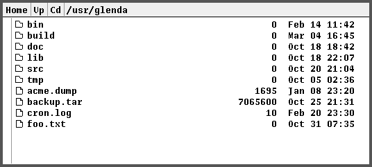

vdir
=====
A minimalistic visual directory browser for Plan9.



Actions are performed using the right mouse button:
- Home: go to current user's home directory
- Open: present an entry to jump to a given directory
- Up  : go to the parent directory
- New dir : present an entry to create a new directory
- New file: present an entry to create a new empty file

Middle-clicking on a file or folder will present a file operations menu.  
Right-clicking on the path (in the toolbar), plumbs the path name  
Right-clicking on folders, opens them.  
Right-clicking on files send them to the plumber.  

Keyboard shortcuts are:
- Page up / Page down to scroll
- Home to go to $home
- Up arrow to go to parent directory
- Space to plumb current directory path
- q / Del to quit

Usage:
------
Install with the usual ``mk install``  
Run ``vdir [directory]``

Path plumbing:
--------------
When right-clicking the path, the path name is sent to plumber.
This can be used to open a window in the directory for instance:
```
src is vdir
type is text
arg isdir $data
plumb start window -cd $data rc
```

Disclaimer:
-----------
This was a quick and dirty hack that sure contains some bugs.  
Enjoy anyway :)
